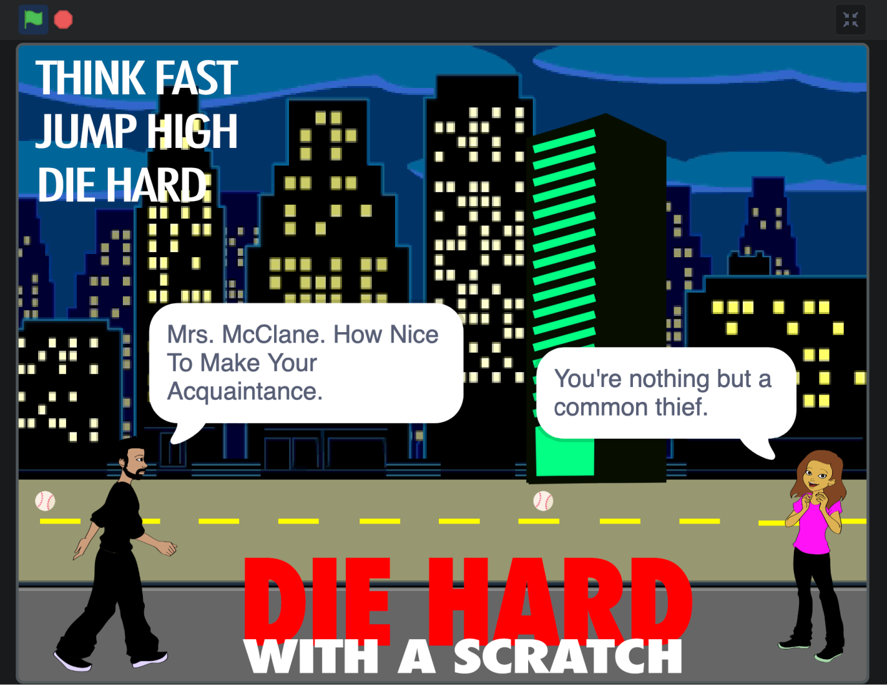
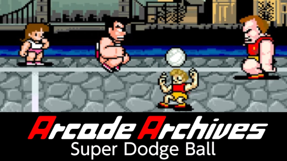
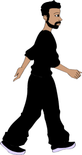

# Die Hard with a Scratch

- Play the game at [https://scratch.mit.edu/projects/773380385][3]
- Project file
  [Die Hard with a Scratch.sb3](./sb3/Die%20Hard%20with%20a%20Scratch.sb3) is
  available under [GPL-3.0 license](../LICENSE).

## Table of Contents

- [Die Hard with a Scratch](#die-hard-with-a-scratch)
  - [Table of Contents](#table-of-contents)
  - [Game Design](#game-design)
  - [Game Design Document](#game-design-document)
    - [High Concept](#high-concept)
    - [Demographic](#demographic)
    - [Overview](#overview)
    - [Characters](#characters)
      - [Hans Gruber](#hans-gruber)
      - [Holly Gennero (Holly McClane)](#holly-gennero-holly-mcclane)
    - [Unique Selling Points](#unique-selling-points)
    - [Gameplay summary](#gameplay-summary)

## Game Design

The following specifies a design for a quick game implemented in Scratch.
It is based on the Die Hard film series and based on the ubiquitous character of
Hans Gruber.

It is a single player game where the player controls the character of Hans
Gruber and must avoid baseballs thrown by the character of Mrs. McClane.

The game is inspired by the classic game of "[Super Dodge Ball][2]". An action
game that was released by Technos Japan in 1987. Players competed with powerful
teams of the world, to become a Super Dodge Ball team of the world. In Japan,
it was the second game with starring Technos Japan's video game character
'Kunio-kun', following 'Nekketsu Koha Kunio-kun'
(the Japanese version of 'Renegade').

[][2]

## Game Design Document

### High Concept

A game where you play as a Hans Gruber type character, trying to dodge baseball
thrown by a pretty upset Mrs. McClane character.

### Demographic

- Target Audience: Classic game fans and Die Hard film fans, any age
- Game Style: Jump and Run
- Platform: Scratch [(https://scratch.mit.edu/)][1]
- Players: 1 (Single Player mode)
- Controls: Keyboard

### Overview

Die Hard's Hans Gruber is considered one of the greatest movie villains of all
time.

Hans Gruber used a lot of theatrics during his takeover of Nakatomi Plaza in
Die Hard, initially leaving everyone at the Christmas party to assume he and his
men were terrorists. It was a ruse they continued to use during their
interactions with the police and the FBI to further their goals.

However, Gruber wasn't above showcasing his intelligence by teasing his hostages
with the revelation that he and his teams were simply high-stakes robbers
looking for a big store.

The game highlights Gruber's manipulations and the joy he took from playing with
others' perceptions of his crimes.

This adrenaline-fuelled, arcade style game is predominately based on Holly
Gennero, formerly Holly McClane, the ex-wife of John McClane.

She has made her mission to throw at Gruber any kind of object that she can find
to stop him from his machiavellian plans.

A fictional Los Angeles environment is presented in the game with the famous
Nakatomi Plaza tower.

### Characters

#### Hans Gruber

Gruber is a cunning thief and criminal mastermind from Germany who holds the Nakatomi Plaza hostage to steal $640 million in negotiable bearer bonds.

#### Holly Gennero (Holly McClane)

Holly Gennero is a former police officer and the ex-wife of John McClane.

### Unique Selling Points

Humour: A true crowd pleasing game featuring a simple game play and classic cop movie characters. The game is a parody of the Die Hard film series and a perfect time for Christmas binge watching.

### Gameplay summary

The game is a single player game where the player controls the character of Hans Gruber and must avoid baseballs thrown by the character of Mrs. McClane.

Just use the space bar to jump and avoid the baseballs.

[1]: https://scratch.mit.edu/
[2]: https://en.wikipedia.org/wiki/Super_Dodge_Ball
[3]: https://scratch.mit.edu/projects/773380385
